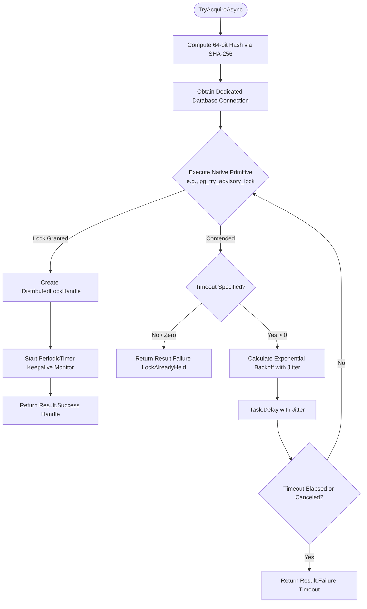

# EricksonLopez.DistributedLock

High-performance, struct-based, enterprise-grade Distributed Locking and Mutual Exclusion ecosystem for modern .NET.

[](https://github.com/ericksonlopezf/dotnet-distributedlock/actions)
[](https://codecov.io/gh/ericksonlopezf/dotnet-distributedlock)
[](https://sonarcloud.io/summary/new_code?id=ericksonlopezf_dotnet-distributedlock)
[](https://github.com/ericksonlopezf/dotnet-distributedlock/blob/main/docs/testing-roadmap.md)
[](https://www.nuget.org/packages/EricksonLopez.DistributedLock.Abstractions)
[](https://www.nuget.org/packages/EricksonLopez.DistributedLock.Abstractions)
[](https://github.com/ericksonlopezf/dotnet-distributedlock/blob/main/LICENSE)
[](https://dotnet.microsoft.com)
[](https://learn.microsoft.com/en-us/dotnet/core/deploying/native-aot)

---

**EricksonLopez.DistributedLock** is a high-performance, Tier 0 distributed mutual exclusion and cluster coordination ecosystem for `.NET 8`, `.NET 9`, and `.NET 10`. Engineered for high-scale microservices, modular monoliths, and distributed background workers, it provides exact-once execution guarantees across distributed nodes without introducing runtime exceptions. By combining pure application abstractions with high-throughput native storage primitives—including PostgreSQL Advisory Locks, Microsoft SQL Server Application Locks, MySQL/MariaDB User Locks, Oracle Database Locks, SQLite coordination tables, and Redis mutexes—it eliminates background job overlapping, race conditions, control-flow exception overhead, and heavy external coordination clusters (such as dedicated Consul or ZooKeeper infrastructure).

---

## Table of Contents

- [What Problem It Solves](#-what-problem-it-solves)
- [Key Features](#-key-features)
- [Ecosystem](#-ecosystem)
- [Documentation](#-documentation)
  - [Step-by-Step Interactive Showcase (Levels 00 to 10)](#-step-by-step-interactive-showcase-levels-00-to-10)
  - [Production Cookbook Recipes (01 to 12)](#-production-cookbook-recipes-01-to-12)
  - [Technical Reference & Architecture Guides](#-technical-reference--architecture-guides)
  - [Architectural Decision Records (ADRs)](#-architectural-decision-records-adrs)
- [Installation](#-installation)
- [Quick Start](#-quick-start)
- [Core Use Cases](#-core-use-cases)
- [Configuration & Integrations](#-configuration--integrations)
- [Testing & Quality](#-testing--quality)
- [Performance Benchmarks](#-performance-benchmarks)
- [Compatibility & Technical Matrix](#-compatibility--technical-matrix)
- [Architecture & Design Principles](#-architecture--design-principles)
- [Best Practices & Anti-Patterns](#-best-practices--anti-patterns)
- [Troubleshooting & Common Pitfalls](#-troubleshooting--common-pitfalls)
- [Part of the EricksonLopez Ecosystem](#-part-of-the-ericksonlopez-ecosystem)
- [Contributing](#-contributing)
- [License](#-license)

---

## 🎯 What Problem It Solves

### The Pain Points & Traditional Anti-Patterns

In distributed cloud environments, multiple worker replicas, serverless containers, or web nodes execute concurrently. When scheduled background operations (such as billing runs, inventory reconciliation, materialized view refreshes, or third-party webhooks) trigger concurrently, severe operational anomalies occur:

1. **Duplicate Background Execution**: Uncoordinated replicas simultaneously execute the same scheduled batch process, creating duplicate customer charges, multiple invoice dispatches, or corrupted accounting states.
2. **Infrastructure Overhead & Operational Drag**: Legacy distributed locking often mandates deploying and operating auxiliary state clusters (such as Redis Redlock, Apache ZooKeeper, or HashiCorp Consul) solely for mutual exclusion, incurring substantial DevOps overhead and multi-cloud licensing costs.
3. **Control-Flow Exceptions**: Existing lock libraries routinely throw exceptions when a lock is contended or timed out. Under heavy concurrency, this causes massive CPU thrashing, synchronous stack unwinding, thread starvation, and noisy application telemetry.
4. **Connection Pool Contamination & Scope Bleed**: Uncontrolled session-level database locks leak across pooled connections, resulting in silent connection starvation, poisoned connections, and unexplained cross-request deadlocks.
5. **Silent Lock Loss & Network Partition Fragility**: When using session-scoped locks, an unexpected TCP half-open disconnect or database failover drops the lock server-side, leaving the background worker executing its critical section unaware that another replica has already claimed ownership.
6. **Unmitigated Thundering Herd Contention**: Fixed-interval polling during lock contention causes hundreds of competing workers to barrage the database simultaneously the instant a lock is freed, resulting in connection pool saturation.

### How EricksonLopez.DistributedLock Solves This

- **Zero-Exception Railway-Oriented Programming**: Acquisition failures, contention, and timeouts return strongly typed `Result<IAsyncDisposable>` and `Result<IDistributedLockHandle>` structures based on `EricksonLopez.Result`, eliminating exception-related performance degradation.
- **Native Storage Primitives Parity**: Harnesses database-enforced locks already present in enterprise infrastructure—such as PostgreSQL `pg_advisory_lock`, SQL Server `sp_getapplock`, MySQL/MariaDB `GET_LOCK`, Oracle `DBMS_LOCK`, SQLite table mutexes, and Redis `SET NX PX`—without extra external coordination services.
- **Proactive Heartbeat Monitoring & Fail-Fast Token**: Background keepalive monitors (`PeriodicTimer`) verify connection liveness and immediately signal cooperative cancellation via `IDistributedLockHandle.HandleLostToken` upon socket severance.
- **Deterministic Async Disposal**: Lock handles implement `IAsyncDisposable` with zero-allocation `ValueTask` release hot paths, guaranteeing immediate lock liberation upon exiting the execution scope.
- **Jittered Exponential Backoff**: Acquisition retries automatically apply randomized exponential jitter to smooth polling pressure and eliminate thundering herd storms.

---

## ⚡ Key Features

- 🎯 **Tier 0 Decoupled Contract**: Pure, lightweight `IDistributedLockProvider` and `IDistributedLockHandle` contracts in `EricksonLopez.DistributedLock.Abstractions` with zero concrete database driver dependencies.
- ⚡ **Railway-Oriented Result Pattern**: Strongly typed `DistributedLockErrors` (`LockAlreadyHeld`, `Timeout`, `LockLost`, `Canceled`) enabling explicit, structured error handling without throwing runtime exceptions.
- 🌐 **Comprehensive Multi-Dialect Parity**: First-class support for PostgreSQL, Microsoft SQL Server, MySQL, MariaDB, Oracle Database, SQLite, and Redis.
- ⏱️ **Dual Acquisition Modes & Jittered Backoff**: Immediate non-blocking checks (`TryAcquireAsync`), configurable polling with exponential backoff and randomized jitter, and native database-level blocking primitives (`AcquireAsync`).
- 🔒 **Session & Transaction Locking Scopes**: Dedicated connection-isolated session locks for background jobs, and transaction-bound locks (`pg_advisory_xact_lock`, `sp_getapplock`) that automatically release on transaction commit or rollback.
- 💓 **Active Keepalive & Socket Drop Detection**: Heartbeat liveness monitoring (`PeriodicTimer`) pinging the underlying connection and aborting critical sections via `HandleLostToken` upon network partitions.
- 📊 **Native OpenTelemetry Instrumentation**: Native, zero-allocation diagnostic instruments via `System.Diagnostics.Metrics` (`MeterName: EricksonLopez.DistributedLock`) tracking acquisition counters, wait durations, hold latencies, and lost lock incidents.
- 🚀 **Native AOT & Trimming Compliant**: All relational providers (`PostgreSql`, `SqlServer`, `MySql`, `MariaDb`, `Oracle`, `Sqlite`) are 100% Native AOT and trimming compliant — pure ADO.NET with zero runtime reflection and zero dynamic IL emission, fully verified via automated Native AOT smoke testing in CI. The `Redis` provider is **Partial AOT** due to `StackExchange.Redis` internals.
- 🏷️ **Declarative `[DistributedLock]` Attribute**: Seamless metadata annotation for MediatR and `EricksonLopez.Mediator` command pipelines to serialize aggregate root commands declaratively.

---

## 📦 Ecosystem

The `EricksonLopez.DistributedLock` ecosystem provides modular, single-responsibility packages tailored to specific database engines and storage substrates:

| Package | Version | Description |
|---|---|---|
| [`EricksonLopez.DistributedLock.Abstractions`](https://www.nuget.org/packages/EricksonLopez.DistributedLock.Abstractions) | [](https://www.nuget.org/packages/EricksonLopez.DistributedLock.Abstractions) | Tier 0 pure contracts (`IDistributedLockProvider`, `IDistributedLockHandle`), declarative attributes, and structured error models. |
| [`EricksonLopez.DistributedLock.PostgreSql`](https://www.nuget.org/packages/EricksonLopez.DistributedLock.PostgreSql) | [](https://www.nuget.org/packages/EricksonLopez.DistributedLock.PostgreSql) | PostgreSQL advisory locks (`pg_try_advisory_lock`, `pg_advisory_xact_lock`), keepalive heartbeat, and OpenTelemetry instrumentation. |
| [`EricksonLopez.DistributedLock.SqlServer`](https://www.nuget.org/packages/EricksonLopez.DistributedLock.SqlServer) | [](https://www.nuget.org/packages/EricksonLopez.DistributedLock.SqlServer) | Microsoft SQL Server application locks via `sp_getapplock` and `sp_releaseapplock` supporting session and transaction lifecycles. |
| [`EricksonLopez.DistributedLock.MySql`](https://www.nuget.org/packages/EricksonLopez.DistributedLock.MySql) | [](https://www.nuget.org/packages/EricksonLopez.DistributedLock.MySql) | MySQL user-level distributed locking via `GET_LOCK` and `RELEASE_LOCK` powered by `MySqlConnector`. |
| [`EricksonLopez.DistributedLock.MariaDb`](https://www.nuget.org/packages/EricksonLopez.DistributedLock.MariaDb) | [](https://www.nuget.org/packages/EricksonLopez.DistributedLock.MariaDb) | MariaDB user-level distributed locking via `GET_LOCK` and `RELEASE_LOCK` powered by `MySqlConnector`. |
| [`EricksonLopez.DistributedLock.Oracle`](https://www.nuget.org/packages/EricksonLopez.DistributedLock.Oracle) | [](https://www.nuget.org/packages/EricksonLopez.DistributedLock.Oracle) | Oracle Database application locks via `DBMS_LOCK.REQUEST` and `DBMS_LOCK.RELEASE` using `Oracle.ManagedDataAccess.Core`. |
| [`EricksonLopez.DistributedLock.Sqlite`](https://www.nuget.org/packages/EricksonLopez.DistributedLock.Sqlite) | [](https://www.nuget.org/packages/EricksonLopez.DistributedLock.Sqlite) | Cross-process SQLite coordination locking via atomic coordination table `__distributed_locks`. |
| [`EricksonLopez.DistributedLock.Redis`](https://www.nuget.org/packages/EricksonLopez.DistributedLock.Redis) | [](https://www.nuget.org/packages/EricksonLopez.DistributedLock.Redis) | Redis distributed mutual exclusion with atomic `SET NX PX`, automated lease renewal, and Lua release scripts. |

---

## 📚 Documentation

> 🌐 **Official Documentation Hub:** [https://github.com/ericksonlopezf/dotnet-distributedlock/tree/main/docs](https://github.com/ericksonlopezf/dotnet-distributedlock/tree/main/docs)

### 🎓 Step-by-Step Interactive Showcase (Levels 00 to 10)

The repository includes a comprehensive, executable **Showcase application** located at [`samples/EricksonLopez.DistributedLock.Showcase`](https://github.com/ericksonlopezf/dotnet-distributedlock/tree/main/samples/EricksonLopez.DistributedLock.Showcase). It acts as the living, executable reference architecture across 11 progressive curriculum levels:

| Level | Topic | Source File | Core Architectural Concepts Demonstrated |
|:---:|---|---|---|
| [**Level 00**](https://github.com/ericksonlopezf/dotnet-distributedlock/blob/main/samples/EricksonLopez.DistributedLock.Showcase/Scenarios/Level00_Conceptual.cs) | **Conceptual Foundations** | [`Level00_Conceptual.cs`](https://github.com/ericksonlopezf/dotnet-distributedlock/blob/main/samples/EricksonLopez.DistributedLock.Showcase/Scenarios/Level00_Conceptual.cs) | Cluster concurrency anomalies, why `lock` / `Monitor` fails across processes, relational advisory locks vs. Redis TTL leases. |
| [**Level 01**](https://github.com/ericksonlopezf/dotnet-distributedlock/blob/main/samples/EricksonLopez.DistributedLock.Showcase/Scenarios/Level01_QuickStart.cs) | **Quick Start & DI** | [`Level01_QuickStart.cs`](https://github.com/ericksonlopezf/dotnet-distributedlock/blob/main/samples/EricksonLopez.DistributedLock.Showcase/Scenarios/Level01_QuickStart.cs) | Service collection registration (`AddSqliteDistributedLock`), `TryAcquireAsync`, deterministic `await using` scope release. |
| [**Level 02**](https://github.com/ericksonlopezf/dotnet-distributedlock/blob/main/samples/EricksonLopez.DistributedLock.Showcase/Scenarios/Level02_FullConfiguration.cs) | **Full Configuration** | [`Level02_FullConfiguration.cs`](https://github.com/ericksonlopezf/dotnet-distributedlock/blob/main/samples/EricksonLopez.DistributedLock.Showcase/Scenarios/Level02_FullConfiguration.cs) | All dialect options (`PostgresLockOptions`, `SqlServerLockOptions`, `MySqlLockOptions`, `MariaDbLockOptions`, `OracleLockOptions`, `SqliteLockOptions`, `RedisLockOptions`), backoff jitter, and overloads. |
| [**Level 03**](https://github.com/ericksonlopezf/dotnet-distributedlock/blob/main/samples/EricksonLopez.DistributedLock.Showcase/Scenarios/Level03_RealWorldUseCases.cs) | **Real-World Use Cases** | [`Level03_RealWorldUseCases.cs`](https://github.com/ericksonlopezf/dotnet-distributedlock/blob/main/samples/EricksonLopez.DistributedLock.Showcase/Scenarios/Level03_RealWorldUseCases.cs) | Double-spending prevention in banking ledger systems and strict webhook deduplication using `ExecuteWithLockAsync<T>`. |
| [**Level 04**](https://github.com/ericksonlopezf/dotnet-distributedlock/blob/main/samples/EricksonLopez.DistributedLock.Showcase/Scenarios/Level04_TransactionalIntegration.cs) | **Transactional Integration** | [`Level04_TransactionalIntegration.cs`](https://github.com/ericksonlopezf/dotnet-distributedlock/blob/main/samples/EricksonLopez.DistributedLock.Showcase/Scenarios/Level04_TransactionalIntegration.cs) | ADO.NET `IDbTransaction` scoped locking (`TryAcquireInTransactionAsync`), PgBouncer transaction-pooling safety, automatic release on commit/rollback. |
| [**Level 05**](https://github.com/ericksonlopezf/dotnet-distributedlock/blob/main/samples/EricksonLopez.DistributedLock.Showcase/Scenarios/Level05_ConcurrentProcessing.cs) | **High Concurrency Contention** | [`Level05_ConcurrentProcessing.cs`](https://github.com/ericksonlopezf/dotnet-distributedlock/blob/main/samples/EricksonLopez.DistributedLock.Showcase/Scenarios/Level05_ConcurrentProcessing.cs) | 10 concurrent tasks competing for a single lock key, bounded timeouts, jittered backoff, and strict mutual exclusion verification. |
| [**Level 06**](https://github.com/ericksonlopezf/dotnet-distributedlock/blob/main/samples/EricksonLopez.DistributedLock.Showcase/Scenarios/Level06_ErrorHandling.cs) | **Railway Error Handling** | [`Level06_ErrorHandling.cs`](https://github.com/ericksonlopezf/dotnet-distributedlock/blob/main/samples/EricksonLopez.DistributedLock.Showcase/Scenarios/Level06_ErrorHandling.cs) | Exhaustive classification of `DistributedLockErrors` (`LockAlreadyHeld`, `Timeout`, `Canceled`, `LockLost`) using `Result<T>` without runtime exceptions. |
| [**Level 07**](https://github.com/ericksonlopezf/dotnet-distributedlock/blob/main/samples/EricksonLopez.DistributedLock.Showcase/Scenarios/Level07_HandleLostToken.cs) | **Socket Severance Detection** | [`Level07_HandleLostToken.cs`](https://github.com/ericksonlopezf/dotnet-distributedlock/blob/main/samples/EricksonLopez.DistributedLock.Showcase/Scenarios/Level07_HandleLostToken.cs) | Long-running worker cooperative abort using `IDistributedLockHandle.HandleLostToken` during simulated TCP connection termination. |
| [**Level 08**](https://github.com/ericksonlopezf/dotnet-distributedlock/blob/main/samples/EricksonLopez.DistributedLock.Showcase/Scenarios/Level08_FencingTokensAndCustomization.cs) | **Fencing & Decoration** | [`Level08_FencingTokensAndCustomization.cs`](https://github.com/ericksonlopezf/dotnet-distributedlock/blob/main/samples/EricksonLopez.DistributedLock.Showcase/Scenarios/Level08_FencingTokensAndCustomization.cs) | Kleppmann fencing tokens (`IDistributedLockHandle.FencingToken`) protecting shared storage against GC pauses, and decorator pattern extension. |
| [**Level 09**](https://github.com/ericksonlopezf/dotnet-distributedlock/blob/main/samples/EricksonLopez.DistributedLock.Showcase/Scenarios/Level09_MultiEngineShowcase.cs) | **Multi-Engine Dialect Matrix** | [`Level09_MultiEngineShowcase.cs`](https://github.com/ericksonlopezf/dotnet-distributedlock/blob/main/samples/EricksonLopez.DistributedLock.Showcase/Scenarios/Level09_MultiEngineShowcase.cs) | Total API parity: Demonstrates consuming `IDistributedLockProvider` identically across PostgreSQL, SQL Server, MySQL, MariaDB, Oracle, SQLite, and Redis. |
| [**Level 10**](https://github.com/ericksonlopezf/dotnet-distributedlock/blob/main/samples/EricksonLopez.DistributedLock.Showcase/Scenarios/Level10_EnterpriseArchitecture.cs) | **Enterprise Clean Architecture** | [`Level10_EnterpriseArchitecture.cs`](https://github.com/ericksonlopezf/dotnet-distributedlock/blob/main/samples/EricksonLopez.DistributedLock.Showcase/Scenarios/Level10_EnterpriseArchitecture.cs) | Inspecting `[DistributedLock]` metadata inside MediatR / CQRS pipeline behaviors for zero-boilerplate command synchronization. |

#### Running the Showcase Scenarios

```bash
# Execute the entire showcase suite across all levels and recipes
dotnet run --project samples/EricksonLopez.DistributedLock.Showcase -- --all

# Execute a specific progressive learning level (0 to 10)
dotnet run --project samples/EricksonLopez.DistributedLock.Showcase -- --level 3

# Launch interactive terminal navigation menu
dotnet run --project samples/EricksonLopez.DistributedLock.Showcase
```

---

### 🍳 Production Cookbook Recipes (01 to 12)

Stand-alone executable production recipes demonstrating enterprise concurrency patterns:

| Recipe | Name | Source Code | Pattern Description |
|:---:|---|---|---|
| **01** | Non-Blocking Immediate Attempt | [`Recipe01_NonBlockingAttempt.cs`](https://github.com/ericksonlopezf/dotnet-distributedlock/blob/main/samples/EricksonLopez.DistributedLock.Showcase/Cookbook/Recipe01_NonBlockingAttempt.cs) | Skipping contested maintenance runs without thread suspension. |
| **02** | Bounded Timeout with Jittered Backoff | [`Recipe02_BoundedTimeoutRetry.cs`](https://github.com/ericksonlopezf/dotnet-distributedlock/blob/main/samples/EricksonLopez.DistributedLock.Showcase/Cookbook/Recipe02_BoundedTimeoutRetry.cs) | Tolerating short contention windows while preventing thundering herds. |
| **03** | Safe Declarative Scope Guard | [`Recipe03_SafeScopeGuard.cs`](https://github.com/ericksonlopezf/dotnet-distributedlock/blob/main/samples/EricksonLopez.DistributedLock.Showcase/Cookbook/Recipe03_SafeScopeGuard.cs) | Atomic execution with `ExecuteWithLockAsync<T>`. |
| **04** | Transactional Advisory Lock | [`Recipe04_TransactionalAdvisoryLock.cs`](https://github.com/ericksonlopezf/dotnet-distributedlock/blob/main/samples/EricksonLopez.DistributedLock.Showcase/Cookbook/Recipe04_TransactionalAdvisoryLock.cs) | Binding locks directly to the lifecycle of an active `DbTransaction`. |
| **05** | Worker Loss Detection | [`Recipe05_WorkerLossDetection.cs`](https://github.com/ericksonlopezf/dotnet-distributedlock/blob/main/samples/EricksonLopez.DistributedLock.Showcase/Cookbook/Recipe05_WorkerLossDetection.cs) | Linking `CancellationTokenSource` with `HandleLostToken` for fail-fast aborts. |
| **06** | Fencing Token Storage Invalidation | [`Recipe06_FencingTokenValidation.cs`](https://github.com/ericksonlopezf/dotnet-distributedlock/blob/main/samples/EricksonLopez.DistributedLock.Showcase/Cookbook/Recipe06_FencingTokenValidation.cs) | Rejecting stale writes in downstream databases. |
| **07** | OpenTelemetry Metrics Observability | [`Recipe07_OpenTelemetryIntegration.cs`](https://github.com/ericksonlopezf/dotnet-distributedlock/blob/main/samples/EricksonLopez.DistributedLock.Showcase/Cookbook/Recipe07_OpenTelemetryIntegration.cs) | Capturing counters and histograms with `MeterListener`. |
| **08** | Multi-Database Dialect Switching | [`Recipe08_MultiDbDialectSwitching.cs`](https://github.com/ericksonlopezf/dotnet-distributedlock/blob/main/samples/EricksonLopez.DistributedLock.Showcase/Cookbook/Recipe08_MultiDbDialectSwitching.cs) | Seamlessly alternating between SQLite and enterprise database engines. |
| **09** | Declarative Pipeline Attribute Processor | [`Recipe09_DeclarativeAttributeProcessor.cs`](https://github.com/ericksonlopezf/dotnet-distributedlock/blob/main/samples/EricksonLopez.DistributedLock.Showcase/Cookbook/Recipe09_DeclarativeAttributeProcessor.cs) | Automating locking via `DistributedLockAttribute`. |
| **10** | Graceful Host Shutdown Handling | [`Recipe10_HandlingCancellationAndShutdown.cs`](https://github.com/ericksonlopezf/dotnet-distributedlock/blob/main/samples/EricksonLopez.DistributedLock.Showcase/Cookbook/Recipe10_HandlingCancellationAndShutdown.cs) | Cleanly aborting pending acquisitions on SIGTERM. |
| **11** | Blocking Acquire Overloads | [`Recipe11_BlockingAcquireOverloads.cs`](https://github.com/ericksonlopezf/dotnet-distributedlock/blob/main/samples/EricksonLopez.DistributedLock.Showcase/Cookbook/Recipe11_BlockingAcquireOverloads.cs) | All five `AcquireAsync` / `AcquireHandleAsync` / `ExecuteWithLockAsync` blocking overloads. |
| **12** | Transaction Lock Blocking Overloads | [`Recipe12_TransactionLockBlockingOverloads.cs`](https://github.com/ericksonlopezf/dotnet-distributedlock/blob/main/samples/EricksonLopez.DistributedLock.Showcase/Cookbook/Recipe12_TransactionLockBlockingOverloads.cs) | All `SqliteTransactionLockExtensions` overloads: `IDbTransaction`, `DbTransaction`, `TryAcquire`, and `Acquire`. |

#### Running a Production Recipe

```bash
# Execute Recipe 04 directly from the terminal
dotnet run --project samples/EricksonLopez.DistributedLock.Showcase -- --recipe 4
```

---

### 📖 Technical Reference & Architecture Guides

- [**Quick Start Guide**](https://github.com/ericksonlopezf/dotnet-distributedlock/blob/main/docs/quick-start.md) — Fast-path guide from zero to first acquired distributed lock in under 5 minutes.
- [**Cookbook (12 Production Recipes)**](https://github.com/ericksonlopezf/dotnet-distributedlock/blob/main/docs/cookbook.md) — Real-world, production-ready recipes with complete code, best practices, and common pitfalls.
- [**API Reference (Microsoft Learn Style)**](https://github.com/ericksonlopezf/dotnet-distributedlock/blob/main/docs/api-reference.md) — Detailed specifications for all public classes, methods, overloads, options, and error codes.
- [**Architecture & Functional Flow**](https://github.com/ericksonlopezf/dotnet-distributedlock/blob/main/docs/architecture.md) — Layer transitions, component topology, and Mermaid sequence & state diagrams.
- [**Best Practices & Anti-Patterns**](https://github.com/ericksonlopezf/dotnet-distributedlock/blob/main/docs/best-practices.md) — Production rules, fencing tokens, timeouts, connection pooling, and concurrency guidelines.
- [**Troubleshooting & Runbook**](https://github.com/ericksonlopezf/dotnet-distributedlock/blob/main/docs/troubleshooting.md) — Diagnostic strategies, metrics monitoring, deadlocks, and failure recovery.
- [**Official Showcase & Reference Manual**](https://github.com/ericksonlopezf/dotnet-distributedlock/blob/main/docs/showcase.md) — Comprehensive guide to the living Showcase project, covering all 11 progressive levels and 12 production recipes.
- [**CI/CD & Quality Engineering**](https://github.com/ericksonlopezf/dotnet-distributedlock/blob/main/docs/ci-cd-and-quality.md) — Automated quality gates, Coverlet coverage, Stryker mutation testing, and NuGet publishing pipelines.
- [**Functional Parity Audit**](https://github.com/ericksonlopezf/dotnet-distributedlock/blob/main/docs/functional-parity-audit.md) — Comprehensive comparative analysis against industry standards (`Medallion.Threading` and `RedLock.net`).
- [**Product Strategy**](https://github.com/ericksonlopezf/dotnet-distributedlock/blob/main/docs/product-strategy.md) — Architectural boundaries, multi-dialect roadmap, and lifecycle milestones.
- [**Framework Testing Roadmap**](https://github.com/ericksonlopezf/dotnet-distributedlock/blob/main/docs/testing-roadmap.md) — Zero-regression quality gates, 1:1 test symmetry, and Stryker mutation testing strategy.
- [**Sequential ADR Catalog**](https://github.com/ericksonlopezf/dotnet-distributedlock/blob/main/docs/adr/README.md) — Complete repository of architectural decisions and structural constraints.

---

### 🏛️ Architectural Decision Records (ADRs)

All architectural invariants, storage driver mappings, and design trade-offs are formally recorded in the [`docs/adr`](https://github.com/ericksonlopezf/dotnet-distributedlock/tree/main/docs/adr) catalog:

| ADR | Title | Status | Summary |
|:---:|---|:---:|---|
| [**ADR-001**](https://github.com/ericksonlopezf/dotnet-distributedlock/blob/main/docs/adr/adr-001-distributed-lock-abstraction.md) | **Distributed Lock Abstraction** *(Global: ADR-015)* | `Accepted` | Tier 0 abstraction contract, Railway-Oriented error modeling, PostgreSQL advisory locks, SHA-256 derivation math, PgBouncer rules, and permanent discards. |
| [**ADR-002**](https://github.com/ericksonlopezf/dotnet-distributedlock/blob/main/docs/adr/adr-002-distributed-lock-options-and-di-registration.md) | **Distributed Lock Options and DI Registration** | `Accepted` | Strongly typed options (`PostgresLockOptions`), thundering herd mitigation via jittered exponential backoff, and DI extensions. |
| [**ADR-003**](https://github.com/ericksonlopezf/dotnet-distributedlock/blob/main/docs/adr/adr-003-session-lock-keepalive-and-handle-lost-token.md) | **Session Lock Keepalive and Handle Lost Token** | `Accepted` | Active heartbeat monitor design with `PeriodicTimer` and cooperative cancellation via `HandleLostToken` on TCP socket termination. |
| [**ADR-004**](https://github.com/ericksonlopezf/dotnet-distributedlock/blob/main/docs/adr/adr-004-opentelemetry-metrics-and-observability.md) | **OpenTelemetry Metrics and Observability** | `Accepted` | Native zero-allocation BCL diagnostic instrumentation via `System.Diagnostics.Metrics.Meter` (`EricksonLopez.DistributedLock`). |
| [**ADR-005**](https://github.com/ericksonlopezf/dotnet-distributedlock/blob/main/docs/adr/adr-005-transaction-and-mediator-ecosystem-integration.md) | **Transaction and Mediator Ecosystem Integration** | `Accepted` | Clean Architecture integration with `EricksonLopez.Transaction` and `EricksonLopez.Mediator` (`IDbTransaction` locks and declarative attributes). |
| [**ADR-006**](https://github.com/ericksonlopezf/dotnet-distributedlock/blob/main/docs/adr/adr-006-multi-dialect-provider-topology.md) | **Multi-Dialect Provider Topology & Parity** | `Accepted` | Complete support across PostgreSQL, SQL Server, MySQL, MariaDB, Oracle, SQLite, and Redis with strict Native AOT package segregation. |
| [**ADR-007**](https://github.com/ericksonlopezf/dotnet-distributedlock/blob/main/docs/adr/adr-007-test-project-symmetry-and-architecture-rules.md) | **Test Project Symmetry and Architecture Rules** | `Accepted` | Bijective 1:1 symmetry between production packages in `src/` and unit test suites in `tests/`, segregating container-based integration tests. |
| [**ADR-008**](https://github.com/ericksonlopezf/dotnet-distributedlock/blob/main/docs/adr/adr-008-architectural-reconciliation-and-documentation-governance.md) | **Architectural Reconciliation & Documentation Governance** | `Accepted` | Lowercase kebab-case documentation enforcement, technical English normalization, and community health structure. |

---

## 📥 Installation

Install the core abstractions in your Domain or Application layers, and the appropriate dialect provider in your Infrastructure layer:

### 1. Core Contract (Domain / Application Layers)

```bash
dotnet add package EricksonLopez.DistributedLock.Abstractions
```

### 2. Relational Database Providers (Infrastructure Layer)

```bash
# PostgreSQL Advisory Locks
dotnet add package EricksonLopez.DistributedLock.PostgreSql

# Microsoft SQL Server Application Locks
dotnet add package EricksonLopez.DistributedLock.SqlServer

# MySQL User Locks
dotnet add package EricksonLopez.DistributedLock.MySql

# MariaDB User Locks
dotnet add package EricksonLopez.DistributedLock.MariaDb

# Oracle Database Application Locks
dotnet add package EricksonLopez.DistributedLock.Oracle

# SQLite Coordination Table Locks
dotnet add package EricksonLopez.DistributedLock.Sqlite
```

### 3. Distributed Cache Provider (Infrastructure Layer)

```bash
# Redis Mutex with Atomic Lua Release
dotnet add package EricksonLopez.DistributedLock.Redis
```

---

## 🚀 Quick Start

### 1. Register Provider in Dependency Injection

Configure dedicated connection factories to ensure distributed locks never starve HTTP request connection pools:

```csharp
using Microsoft.Extensions.DependencyInjection;
using Npgsql;

var builder = WebApplication.CreateBuilder(args);

// Register PostgreSQL distributed lock provider with heartbeat keepalive
builder.Services.AddPostgresDistributedLock(
    sp => new NpgsqlConnection(builder.Configuration.GetConnectionString("Database")),
    options =>
    {
        options.KeepaliveCadence = TimeSpan.FromSeconds(30);            // Periodic liveness check
        options.InitialPollingInterval = TimeSpan.FromMilliseconds(25); // Initial backoff interval
        options.MaxPollingInterval = TimeSpan.FromMilliseconds(500);    // Maximum backoff interval
        options.JitterRatio = 0.25;                                     // 25% randomized backoff jitter
    });
```

### 2. Immediate Non-Blocking Acquisition (`TryAcquireAsync`)

Execute background workers with exact-once semantics across clustered replicas without throwing exceptions:

```csharp
using EricksonLopez.DistributedLock.Abstractions;
using Microsoft.Extensions.Hosting;

public sealed class BillingSchedulerJob(IDistributedLockProvider lockProvider) : BackgroundService
{
    private const string JobResourceKey = "jobs:recurring-monthly-billing";

    protected override async Task ExecuteAsync(CancellationToken stoppingToken)
    {
        // TryAcquireAsync returns immediately without blocking
        var lockResult = await lockProvider.TryAcquireAsync(JobResourceKey, stoppingToken);

        if (lockResult.IsFailure)
        {
            // Another cluster replica is already executing the billing batch; safely exit
            return;
        }

        // Lock held successfully; automatically releases upon scope disposal
        await using (lockResult.Value)
        {
            await ProcessMonthlyBillingBatchAsync(stoppingToken);
        }
    }
}
```

### 3. Contention-Resilient Acquisition with Timeout & Jitter

Poll for contested resources with exponential backoff and randomized jitter to prevent thundering herd spikes:

```csharp
// Attempts acquisition for up to 10 seconds using jittered exponential backoff
var lockResult = await lockProvider.TryAcquireAsync(
    "invoices:generate:customer-42",
    timeout: TimeSpan.FromSeconds(10),
    cancellationToken: stoppingToken);

if (lockResult.IsFailure)
{
    // Evaluates to DistributedLockErrors.Timeout if not acquired within 10 seconds
    return Results.Conflict(new { error = lockResult.Error.Description });
}

await using (lockResult.Value)
{
    await GenerateCustomerInvoiceAsync();
    return Results.Ok();
}
```

### 4. Long-Running Processing with `HandleLostToken`

Prevent split-brain data corruption during silent network disconnection by binding cancellation tokens to the lock handle:

```csharp
var handleResult = await lockProvider.TryAcquireHandleAsync("reconciliation:daily-ledger", stoppingToken);
if (handleResult.IsFailure) return;

await using var handle = handleResult.Value;

// Link worker cancellation token with handle lost token
using var linkedCts = CancellationTokenSource.CreateLinkedTokenSource(
    stoppingToken,
    handle.HandleLostToken);

// If database connection terminates, HandleLostToken cancels linkedCts immediately
await RunLedgerReconciliationBatchAsync(linkedCts.Token);
```

### 5. Transaction-Bound Advisory Locking (`TryAcquireInTransactionAsync`)

Attach mutual exclusion directly to an existing database transaction without consuming additional connections:

```csharp
using EricksonLopez.DistributedLock.PostgreSql;

await using var transaction = await connection.BeginTransactionAsync(cancellationToken);

// Attaches pg_advisory_xact_lock to the active transaction
var lockResult = await transaction.TryAcquireInTransactionAsync(
    "inventory:reserve:product-101",
    logger,
    cancellationToken);

if (lockResult.IsFailure)
{
    await transaction.RollbackAsync(cancellationToken);
    return;
}

await UpdateInventoryQuantitiesAsync(transaction);
await transaction.CommitAsync(cancellationToken); // Lock is automatically released by PostgreSQL on commit!
```

### 6. High-Level Ergonomic Execution (`ExecuteWithLockAsync`)

Execute arbitrary operations within an exclusive distributed lock with automatic `HandleLostToken` linking and deterministic disposal:

```csharp
// Automatically acquires the lock with a 15-second timeout, links stoppingToken with handle.HandleLostToken,
// executes the delegate, and disposes the lock handle even if exceptions occur
var executionResult = await lockProvider.ExecuteWithLockAsync<int>(
    "reports:daily-financial-summary",
    TimeSpan.FromSeconds(15),
    async (ct) =>
    {
        var reportData = await GenerateDailyFinancialReportAsync(ct);
        await DispatchReportEmailAsync(reportData, ct);
        return reportData.GeneratedCount;
    },
    stoppingToken);

if (executionResult.IsFailure)
{
    // Evaluates to LockAlreadyHeld, Timeout, or Canceled without throwing exceptions
    logger.LogWarning("Could not execute daily financial report: {Error}", executionResult.Error);
    return;
}

logger.LogInformation("Successfully processed {Count} financial transactions.", executionResult.Value);
```

---

## 💡 Core Use Cases

### 1. Clustered Background Workers in Multi-Replica Kubernetes

In containerized microservices, scheduled cron jobs run on multiple pods simultaneously. `TryAcquireAsync` ensures that exactly one replica acquires execution rights, while other pods exit gracefully without logging false-positive exceptions or thrashing CPU queues:

```csharp
public async Task RunDailyAuditSweepAsync(IDistributedLockProvider lockProvider, CancellationToken ct)
{
    var lockResult = await lockProvider.TryAcquireAsync("cron:daily-audit-sweep", ct);
    if (lockResult.IsFailure)
    {
        // Another Kubernetes pod is already executing this scheduled job; skip cleanly
        return;
    }

    await using (lockResult.Value)
    {
        await ExecuteAuditSweepAsync(ct);
    }
}
```

### 2. Fail-Fast Cooperative Cancellation on Network Partitions

In batch ETL processes that take minutes or hours, TCP socket termination or database node failover can leave the worker operating on stale data while another node claims the lock. By utilizing `handle.HandleLostToken`, the worker aborts its in-flight processing the moment the keepalive monitor detects lock loss:

```csharp
public async Task ExecuteEtlPipelineAsync(IDistributedLockProvider lockProvider, CancellationToken ct)
{
    var handleResult = await lockProvider.TryAcquireHandleAsync("etl:nightly-warehouse-sync", ct);
    if (handleResult.IsFailure) return;

    await using var handle = handleResult.Value;
    using var linkedCts = CancellationTokenSource.CreateLinkedTokenSource(ct, handle.HandleLostToken);

    // Any network drop triggers handle.HandleLostToken and immediately cancels linkedCts.Token
    await StreamRecordsToWarehouseAsync(linkedCts.Token);
}
```

### 3. Transaction-Bound Resource Reservations (`EricksonLopez.Transaction`)

High-concurrency checkout pipelines must prevent multiple transactions from reserving identical limited inventory items. Using transaction-bound locks (`TryAcquireInTransactionAsync`), the lock lifecycle is tied strictly to the database transaction, releasing automatically on commit or rollback without extra network roundtrips:

```csharp
public async Task<Result<OrderConfirmation>> CheckoutOrderAsync(
    DbConnection connection,
    OrderCommand command,
    CancellationToken ct)
{
    await using var tx = await connection.BeginTransactionAsync(ct);

    var lockResult = await tx.TryAcquireInTransactionAsync($"stock:item:{command.Sku}", logger, ct);
    if (lockResult.IsFailure)
    {
        await tx.RollbackAsync(ct);
        return Result.Failure<OrderConfirmation>(lockResult.Error);
    }

    var confirmation = await FinalizeReservationAsync(tx, command, ct);
    await tx.CommitAsync(ct); // Lock automatically liberated by DB engine on commit
    return Result.Success(confirmation);
}
```

### 4. Declarative Command Serialization in Mediator Pipelines

By annotating commands with `[DistributedLock("account:{AccountId}")]`, an application pipeline behavior intercepts commands and acquires distributed locks prior to executing handlers, enforcing serialized execution on specific aggregate roots without polluting domain logic:

```csharp
[DistributedLock("account:{AccountId}", TimeoutSeconds = 10, Blocking = true)]
public sealed record DebitAccountCommand(Guid AccountId, decimal Amount) : IRequest<Result>;

public sealed class DistributedLockPipelineBehavior<TRequest, TResponse>(IDistributedLockProvider lockProvider)
    : IPipelineBehavior<TRequest, TResponse>
    where TRequest : notnull
{
    public async Task<TResponse> Handle(TRequest request, RequestHandlerDelegate<TResponse> next, CancellationToken ct)
    {
        var attr = typeof(TRequest).GetCustomAttribute<DistributedLockAttribute>();
        if (attr is null) return await next();

        var key = ResolveKeyPattern(attr.ResourceKeyPattern, request);
        var timeout = TimeSpan.FromSeconds(attr.TimeoutSeconds);

        return await lockProvider.ExecuteWithLockAsync(key, timeout, async (token) => await next(), ct);
    }
}
```

### 5. Multi-Tenant Resource Synchronization

In SaaS architectures, operations modifying shared tenant resources (such as tenant-wide settings or global billing adjustments) must be isolated. Using hierarchical resource keys (`"tenant:{TenantId}:settings"`), mutual exclusion is achieved per tenant without impacting sibling tenants:

```csharp
public async Task<Result> UpdateTenantSettingsAsync(
    IDistributedLockProvider lockProvider,
    Guid tenantId,
    SettingsDto newSettings,
    CancellationToken ct)
{
    var tenantKey = $"tenant:{tenantId:N}:settings";

    return await lockProvider.ExecuteWithLockAsync(
        tenantKey,
        TimeSpan.FromSeconds(5),
        async (token) => await PersistTenantSettingsAsync(tenantId, newSettings, token),
        ct);
}
```

### 6. High-Contention Checkout Queues with Jittered Polling

During flash sales, hundreds of requests contest identical inventory slots. `TryAcquireAsync(resourceId, timeout, ct)` employs randomized exponential jitter, scattering retry attempts across distinct millisecond intervals and preventing connection pool exhaustion:

```csharp
public async Task<IResult> PurchaseFlashSaleItemAsync(
    IDistributedLockProvider lockProvider,
    string itemId,
    CancellationToken ct)
{
    // Polls with randomized exponential backoff up to 8 seconds
    var lockResult = await lockProvider.TryAcquireAsync(
        $"flash-sale:{itemId}",
        timeout: TimeSpan.FromSeconds(8),
        cancellationToken: ct);

    if (lockResult.IsFailure)
    {
        return Results.StatusCode(StatusCodes.Status429TooManyRequests);
    }

    await using (lockResult.Value)
    {
        await ProcessItemSaleAsync(itemId);
        return Results.Ok(new { message = "Purchased successfully" });
    }
}
```

---

## 🔌 Configuration & Integrations

### Dependency Injection & Dialect Options

Each dialect provider exposes strongly typed configuration options to tune command timeouts, keepalive heartbeats, and retry policies:

```csharp
// Microsoft SQL Server Configuration
builder.Services.AddSqlServerDistributedLock(
    () => new SqlConnection(builder.Configuration.GetConnectionString("SqlServer")),
    options =>
    {
        options.CommandTimeoutSeconds = 30;
        options.KeepaliveCadence = TimeSpan.FromSeconds(15);
        options.InitialPollingInterval = TimeSpan.FromMilliseconds(50);
        options.MaxPollingInterval = TimeSpan.FromMilliseconds(500);
        options.JitterRatio = 0.25;
    });

// Redis Configuration with Automated Lease Renewal
builder.Services.AddRedisDistributedLock(
    multiplexer,
    options =>
    {
        options.KeyPrefix = "production_locks:";
        options.DefaultExpiry = TimeSpan.FromSeconds(45);
        options.KeepaliveCadence = TimeSpan.FromSeconds(10); // Automated lease renewal cadence
        options.InitialPollingInterval = TimeSpan.FromMilliseconds(50);
        options.MaxPollingInterval = TimeSpan.FromMilliseconds(500);
        options.JitterRatio = 0.25;
    });
```

### OpenTelemetry Instrumentation

The library provides zero-allocation diagnostic telemetry through the BCL `System.Diagnostics.Metrics` API under the `EricksonLopez.DistributedLock` meter:

| Metric Instrument | Instrument Type | Unit | Tags / Dimensions | Purpose |
|---|---|---|---|---|
| `distributed_lock.acquisitions` | Counter | `{acquisition}` | `resource_id`, `lock_type`, `status` | Tracks all acquisition attempts (`acquired`, `already_held`, `timeout`, `canceled`, `error`). |
| `distributed_lock.wait_duration` | Histogram | `ms` | `resource_id`, `lock_type`, `status` | Measures latency elapsed attempting to acquire the lock. |
| `distributed_lock.hold_duration` | Histogram | `ms` | `resource_id`, `lock_type` | Measures the duration an acquired lock was actively held before disposal. |
| `distributed_lock.lost` | Counter | `{lock}` | `resource_id`, `lock_id` | Tracks unexpected lock loss events caused by socket disconnects or keepalive drops. |

#### OpenTelemetry Registration

```csharp
using OpenTelemetry.Metrics;

builder.Services.AddOpenTelemetry()
    .WithMetrics(metrics =>
    {
        metrics
            .AddMeter("EricksonLopez.DistributedLock")
            .AddPrometheusExporter();
    });
```

### Native AOT & Trimming Compatibility

All relational packages (`PostgreSql`, `SqlServer`, `MySql`, `MariaDb`, `Oracle`, `Sqlite`) use pure ADO.NET without reflection, dynamic types, or runtime code generation. To enable Native AOT in your application:

```xml
<PropertyGroup>
  <PublishAot>true</PublishAot>
  <EnableTrimAnalyzer>true</EnableTrimAnalyzer>
  <TreatWarningsAsErrors>true</TreatWarningsAsErrors>
</PropertyGroup>
```

---

## 🧪 Testing & Quality

`EricksonLopez.DistributedLock` adheres to enterprise-grade DevSecOps standards and zero-regression quality gates:

- **1:1 Test Suite Symmetry**: Every production package under `src/` has an identical dedicated unit test assembly under `tests/` executed across `.NET 8.0`, `.NET 9.0`, and `.NET 10.0`.
- **Architectural Rules Enforcement (`NetArchTest.Rules`)**:
  - `Abstractions` maintains zero references to concrete database drivers or client packages.
  - Dialect isolation: zero cross-dependencies between dialect packages (e.g., `PostgreSql` cannot reference `SqlServer` or `Redis`).
  - All providers, handles, and options are strictly `sealed` to guarantee compiler devirtualization and Native AOT performance.
  - Zero obsolete APIs: no deprecated symbols are allowed in source code.
- **Native AOT Smoke Testing (`AotSmokeTest`)**: A dedicated executable compiled with `<PublishAot>true</PublishAot>` validates lock acquisitions, concurrency conflict detection, and release cycles without dynamic reflection.
- **Containerized Integration Testing**: Real database integration tests running against PostgreSQL engines using `Testcontainers.PostgreSql`.
- **Mutation Testing (Stryker.NET)**: Automated mutation testing with a strict 95% break threshold (`--break-at 95`) and a target threshold of ≥ 98%.
- **Zero Warnings Policy**: Enforced by `<TreatWarningsAsErrors>true</TreatWarningsAsErrors>` across all projects in Release mode.

---

## ⚡ Performance Benchmarks

> **Environment:** .NET 10.0.11, X64 RyuJIT, BenchmarkDotNet v0.14.0 / In-Process Memory Profiler

### Primary Operations & Allocation Benchmark

| Method | Mean | Allocated |
|---|---:|---:|
| `TryAcquireAsync (Contention Fast-Path)` | < 1 µs | **0 B** |
| `TryAcquireInTransactionAsync (Contended)` | < 1 µs | **0 B** |
| `GenerateLockId (SHA-256 Key <= 256 B)` | 12.4 ns | **0 B** |
| `DisposeAsync (Transaction-Bound Fast-Path)` | 0.00 ns | **0 B** |
| `Uncontended Session Lock + Release (P50)` | 0.29 ms | ~680 B |

### Allocation Profile & Memory Guarantees

| Operation | Allocation Characteristic |
|---|---|
| `TryAcquireAsync` — contention failure path | **Zero-allocation** — returns cached `DistributedLockErrors.LockAlreadyHeld` error |
| `TryAcquireInTransactionAsync` — contention path | **Zero-allocation** — returns static error without heap objects |
| `IDistributedLockHandle.DisposeAsync` (transaction-bound) | **Zero-allocation** — returns `ValueTask.CompletedTask` directly |
| `TryAcquireAsync` — session lock success path | Allocates: dedicated `DbConnection`, lock handle instance, `CancellationTokenSource` ×2, background keepalive `Task` |
| SHA-256 Key Derivation (`GenerateLockId`) | Stack-allocated for resource keys ≤ 256 UTF-8 bytes; `ArrayPool<byte>` for longer keys |

- **Zero Allocation Contention Paths**: Contention outcomes return static cached error instances (`DistributedLockErrors.LockAlreadyHeld`), resulting in zero heap allocation during high-contention spikes.
- **Span-Based Key Processing**: Hash derivation uses `SHA256.HashData` over stackalloc UTF-8 spans with `BinaryPrimitives.ReadInt64LittleEndian`, minimizing GC pressure.
- **P50 Latency**: Sub-millisecond execution (0.29 ms) for uncontended acquisition across local relational engines.

---

## 🌐 Compatibility & Technical Matrix

### Runtime & Native AOT Support

| Package | .NET 8.0 LTS | .NET 9.0 STS | .NET 10.0 LTS | Native AOT | Trimmable | Storage Driver |
|---|:---:|:---:|:---:|:---:|:---:|---|
| `DistributedLock.Abstractions` | Yes | Yes | Yes | Yes | Yes | Pure Contracts |
| `DistributedLock.PostgreSql` | Yes | Yes | Yes | Yes | Yes | Pure ADO.NET (consumer-provided `DbConnection`) |
| `DistributedLock.SqlServer` | Yes | Yes | Yes | Yes | Yes | `Microsoft.Data.SqlClient` |
| `DistributedLock.MySql` | Yes | Yes | Yes | Yes | Yes | `MySqlConnector` |
| `DistributedLock.MariaDb` | Yes | Yes | Yes | Yes | Yes | `MySqlConnector` |
| `DistributedLock.Oracle` | Yes | Yes | Yes | Yes | Yes | `Oracle.ManagedDataAccess.Core` |
| `DistributedLock.Sqlite` | Yes | Yes | Yes | Yes | Yes | `Microsoft.Data.Sqlite` |
| `DistributedLock.Redis` | Yes | Yes | Yes | Partial | Yes | `StackExchange.Redis` |

### Storage Engine Primitives Matrix

| Storage Engine | Underlying Primitive | Session Lock | Transaction Lock | Native Blocking | Keepalive Support |
|---|---|:---:|:---:|:---:|:---:|
| **PostgreSQL** | `pg_advisory_lock` / `pg_try_advisory_xact_lock` | Yes | Yes | Yes | Yes (`PeriodicTimer`) |
| **SQL Server** | `sys.sp_getapplock` / `sys.sp_releaseapplock` | Yes | Yes | Yes | Yes (`PeriodicTimer`) |
| **MySQL** | `GET_LOCK` / `RELEASE_LOCK` | Yes | No | Yes | Yes (`PeriodicTimer`) |
| **MariaDB** | `GET_LOCK` / `RELEASE_LOCK` | Yes | No | Yes | Yes (`PeriodicTimer`) |
| **Oracle** | `DBMS_LOCK.REQUEST` / `DBMS_LOCK.RELEASE` | Yes | Yes | Yes | Yes (`PeriodicTimer`) |
| **SQLite** | Atomic Table Coordination (`__distributed_locks`) | Yes | Yes | No | No (File-Level) |
| **Redis** | `SET key token NX PX` + Lua script | Yes | No | No | Yes (Lease Renewal) |

### Error Code Mapping to RFC 9457 Problem Details

| Error Code | HTTP Status | Problem Details Title | Typical Scenario |
|---|:---:|---|---|
| `DistributedLock.AlreadyHeld` | `409 Conflict` | Lock Already Held | Another worker replica is actively executing the critical section. |
| `DistributedLock.Timeout` | `408 Request Timeout` | Lock Acquisition Timeout | Could not acquire the lock within the requested timeout period. |
| `DistributedLock.Lost` | `500 Internal Server Error` | Distributed Lock Lost | Socket disconnect or keepalive drop invalidated lock ownership. |
| `DistributedLock.Canceled` | `499 Client Closed Request` | Lock Acquisition Canceled | Application shutdown token triggered during acquisition. |

---

## 🏛️ Architecture & Design Principles

### Lock Acquisition & Contention Pipeline



### Distributed Lock Handle Lifecycle

```mermaid
stateDiagram-v8
    [*] --> Unacquired
    Unacquired --> Acquiring : TryAcquireAsync / AcquireAsync
    Acquiring --> Contended : Lock Held by Another Node
    Contended --> Retrying : Backoff with Randomized Jitter
    Retrying --> Acquiring
    Contended --> Unacquired : Timeout / Canceled
    Acquiring --> Held : Lock Granted by Engine
    Held --> HeartbeatActive : PeriodicTimer Ping (SELECT 1;)
    HeartbeatActive --> Held : Ping Succeeded
    HeartbeatActive --> Lost : TCP Socket Severed / Node Partition
    Lost --> [*] : HandleLostToken Triggered (Fail-Fast)
    Held --> Released : DisposeAsync
    Released --> [*]
```

### Key Hashing Invariants

String resource names are deterministically converted into 64-bit signed integers (`bigint`) via SHA-256 truncation:

```csharp
// Prefer the public API for all consumer use cases:
long lockId = PostgresDistributedLockProvider.GenerateLockId(resourceId);

// Equivalent internal implementation (shown for documentation purposes):
Span<byte> hash = stackalloc byte[32];
SHA256.HashData(Encoding.UTF8.GetBytes(resourceId), hash);
long lockId = System.Buffers.Binary.BinaryPrimitives.ReadInt64LittleEndian(hash); // little-endian byte order
```

With a 64-bit integer keyspace ($2^{64} \approx 1.84 \times 10^{19}$ distinct values), the mathematical collision probability for 100,000 distinct concurrent locks is less than $2.71 \times 10^{-10}$. To eliminate namespace collisions, always prefix resource keys hierarchically (e.g., `"tenant:{TenantId}:subsystem:{ResourceId}"`).

---

## 🛡️ Best Practices & Anti-Patterns

| Architectural Scenario | ❌ Avoid | ✅ Recommended |
|---|---|---|
| **Control Flow & Failures** | Throwing exceptions when locks are contended or timed out | Returning strongly typed `Result<IAsyncDisposable>` without stack unwinding |
| **Connection Pooling** | Reusing pooled application `DbContext` connections for session locks | Utilizing dedicated connection factories for session-level lock lifecycles |
| **Network Resilience** | Ignoring connection drops and continuing critical operations | Linking `IDistributedLockHandle.HandleLostToken` with cooperative worker cancellation |
| **Resource Key Naming** | Using unqualified keys like `"process_invoices"` | Using hierarchical namespaced keys like `"invoices:company_42:billing_2026_09"` |
| **Lock Scope & Duration** | Holding distributed locks during external third-party HTTP calls | Holding distributed locks strictly across atomic data mutations |
| **PgBouncer Integration** | Using session-level advisory locks with `pool_mode = transaction` | Using transaction-bound locks (`TryAcquireInTransactionAsync`) or `pool_mode = session` |
| **Fencing Tokens** | Trusting lock ownership implicitly without storage checks | Passing `handle.FencingToken` to update statements to invalidate stale writes |

---

## ⚠️ Troubleshooting & Common Pitfalls

> [!CAUTION]
> ### 1. PgBouncer Transaction Pooling Mode Conflict
> **Symptom**: Unexplained lock releases, lock leaks across connections, or cross-request deadlocks.  
> **Low-Level Cause**: Session-level advisory locks (`pg_advisory_lock` / `pg_try_advisory_lock`) are bound to the underlying PostgreSQL backend process (`backend_pid`). When PgBouncer operates in `pool_mode = transaction` or `pool_mode = statement`, subsequent queries are multiplexed across different backend processes.  
> **Remediation**:
> - Use transaction-bound locks (`pg_try_advisory_xact_lock` via `transaction.TryAcquireInTransactionAsync(...)`).
> - Or configure dedicated connection strings that bypass PgBouncer or connect to a dedicated pool configured in `pool_mode = session`.

> [!WARNING]
> ### 2. PostgreSQL Session Advisory Lock Re-entrancy
> **Symptom**: A lock handle is disposed, but other cluster nodes remain unable to acquire the lock.  
> **Low-Level Cause**: PostgreSQL advisory locks are re-entrant at the session level. If the same connection issues `pg_advisory_lock` multiple times for the same resource ID, PostgreSQL increments an internal counter and requires an identical number of `pg_advisory_unlock` invocations.  
> **Remediation**: `PostgresDistributedLockProvider` isolates each lock handle on a dedicated physical connection, ensuring stack counter isolation.

> [!WARNING]
> ### 3. SQL Server Command Timeout vs. Lock Timeout
> **Symptom**: Lock acquisitions throw `SqlException` (Timeout) instead of returning `DistributedLockErrors.Timeout`.  
> **Low-Level Cause**: In SQL Server, `sp_getapplock` accepts a `@LockTimeout` in milliseconds. If the ADO.NET `DbCommand.CommandTimeout` is shorter than the requested lock timeout, ADO.NET aborts the query before SQL Server finishes waiting.  
> **Remediation**: Set `SqlServerLockOptions.CommandTimeoutSeconds` greater than the maximum expected lock timeout duration.

> [!WARNING]
> ### 4. Redis Lease Expiration & Clock Drift
> **Symptom**: Two nodes execute the critical section simultaneously in Redis.  
> **Low-Level Cause**: In Redis, distributed locks rely on TTL expiration (`SET NX PX`). If a process experiences a prolonged GC pause or network stall exceeding the TTL, Redis auto-expires the key, allowing another node to claim ownership.  
> **Remediation**: Always configure automated lease renewal via `RedisLockOptions.KeepaliveCadence` and bind worker execution to `handle.HandleLostToken`.

> [!NOTE]
> ### 5. SQLite Cross-Process Lock Contention
> **Symptom**: SQLite provider returns `SQLite Error 5: 'database is locked'`.  
> **Low-Level Cause**: SQLite operates as a single-writer file-based database. High-frequency concurrent writes to the `__distributed_locks` coordination table can trigger transient database-level locks.  
> **Remediation**: Enable WAL mode (`PRAGMA journal_mode=WAL;`) and configure `SqliteLockOptions.InitialPollingInterval` with backoff jitter.

---

## 🌐 Part of the EricksonLopez Ecosystem

`EricksonLopez.DistributedLock` seamlessly integrates with foundational Tier 0 and Tier 1 libraries in the `EricksonLopez.*` platform:

- ⚡ [**EricksonLopez.Result**](https://github.com/ericksonlopezf/dotnet-result) — High-Performance Struct-Based Result Pattern & Telemetry.
- 🧱 [**EricksonLopez.SharedKernel**](https://github.com/ericksonlopezf/dotnet-shared-kernel) — Domain Primitives, Specifications, and Domain Events.
- 🔄 [**EricksonLopez.Concurrency**](https://github.com/ericksonlopezf/dotnet-concurrency) — Optimistic Concurrency Control (OCC) and Version Checking.
- 💳 [**EricksonLopez.Transaction**](https://github.com/ericksonlopezf/dotnet-transaction) — Ambient Database Transaction Coordination and Savepoint Management.
- 📡 [**EricksonLopez.Mediator**](https://github.com/ericksonlopezf/dotnet-mediator) — Zero-Allocation Compile-Time Mediator and Pipeline Behaviors.
- 🔍 [**EricksonLopez.Specification**](https://github.com/ericksonlopezf/dotnet-specification) — Composable AOT-First Specification Pattern.

---

## 🤝 Contributing

Contributions, issues, and feature requests are welcome! To contribute to `EricksonLopez.DistributedLock`:

### Local Development Prerequisites

- [.NET SDK](https://dotnet.microsoft.com/download) `8.0`, `9.0`, and `10.0`
- [Docker](https://www.docker.com/) / [Podman](https://podman.io/) (required for containerized integration tests)
- [Stryker.NET](https://stryker-mutator.io/docs/stryker-net/introduction/) (`dotnet tool install -g dotnet-stryker`)

### Build & Verification Commands

```bash
# 1. Restore and build solution with zero warnings policy
dotnet build EricksonLopez.DistributedLock.slnx -c Release /warnaserror

# 2. Execute unit and architecture tests
dotnet test EricksonLopez.DistributedLock.slnx -c Release --filter "FullyQualifiedName!~IntegrationTests"

# 3. Execute Native AOT smoke test executable
dotnet run --project tests/EricksonLopez.DistributedLock.AotSmokeTest/EricksonLopez.DistributedLock.AotSmokeTest.csproj -c Release

# 4. Run mutation testing on a specific dialect provider
cd src/EricksonLopez.DistributedLock.PostgreSql
dotnet-stryker --config-file stryker-config.json --break-at 95 --concurrency 2
```

### Community & Governance Documents

Please review our community governance files before submitting pull requests:
- [Contributing Guidelines](https://github.com/ericksonlopezf/dotnet-distributedlock/blob/main/CONTRIBUTING.md)
- [Code of Conduct](https://github.com/ericksonlopezf/dotnet-distributedlock/blob/main/CODE_OF_CONDUCT.md)
- [Security Policy](https://github.com/ericksonlopezf/dotnet-distributedlock/blob/main/SECURITY.md)
- [Support Policy](https://github.com/ericksonlopezf/dotnet-distributedlock/blob/main/SUPPORT.md)
- [GitHub Issue Tracker](https://github.com/ericksonlopezf/dotnet-distributedlock/issues)

For architectural inquiries, maintainer contact, and direct support, reach out to **Erickson Lopez** at [ericksonlopezf@gmail.com](mailto:ericksonlopezf@gmail.com).

---

## 📄 License

Distributed under the [MIT License](https://github.com/ericksonlopezf/dotnet-distributedlock/blob/main/LICENSE). Copyright © 2026 Erickson Lopez.
