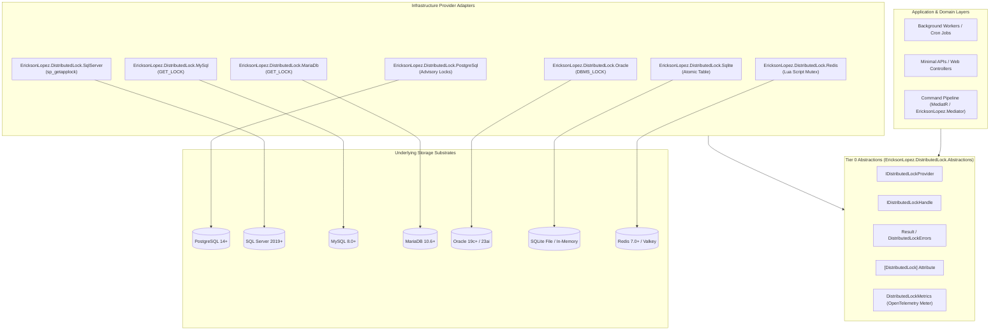
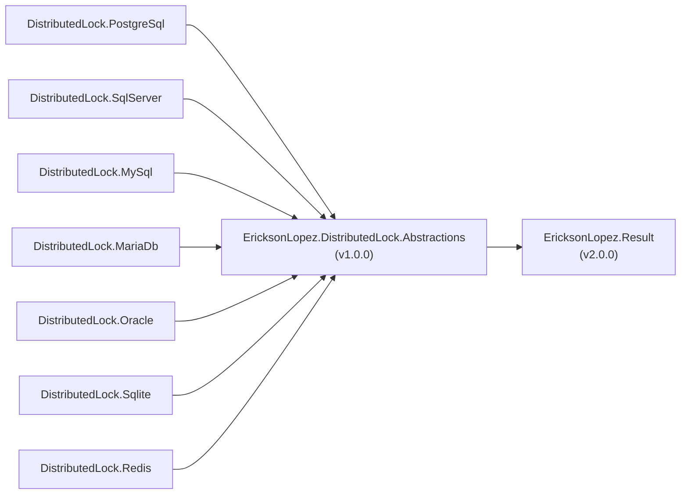
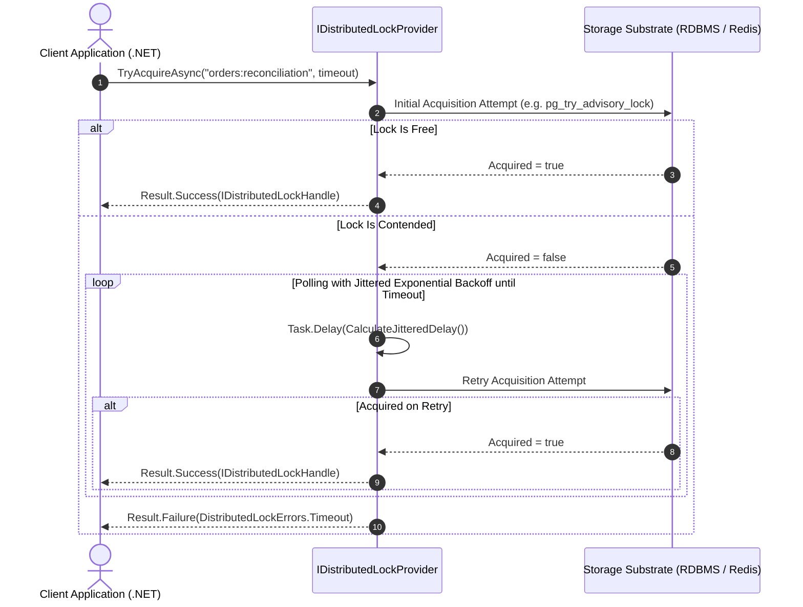
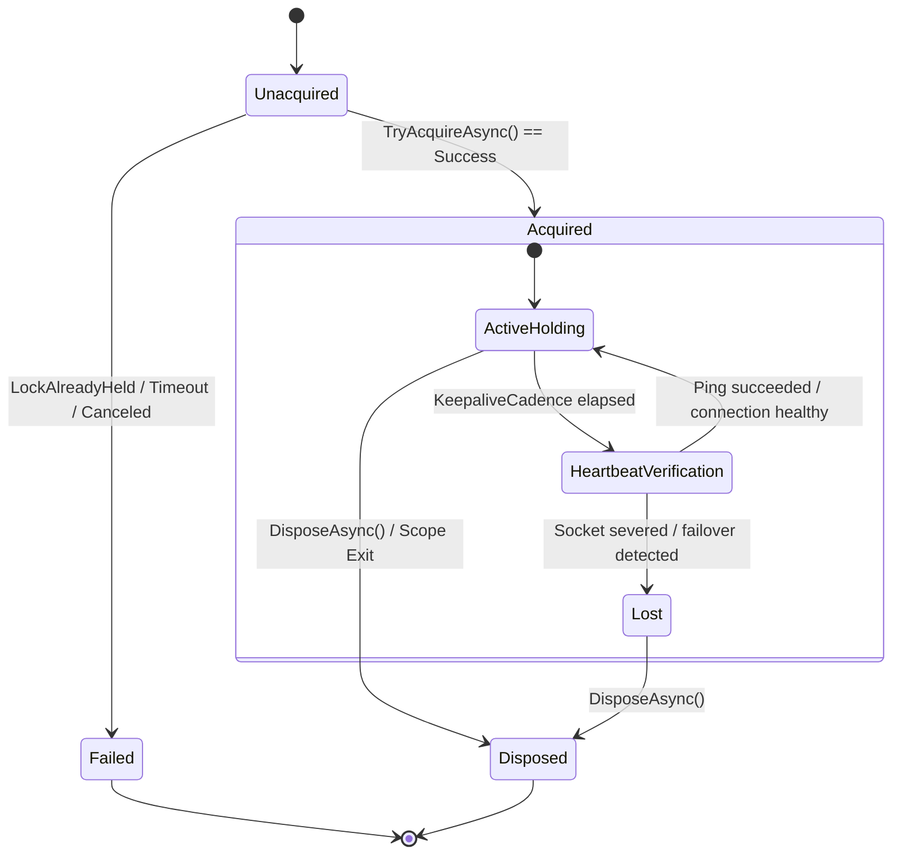
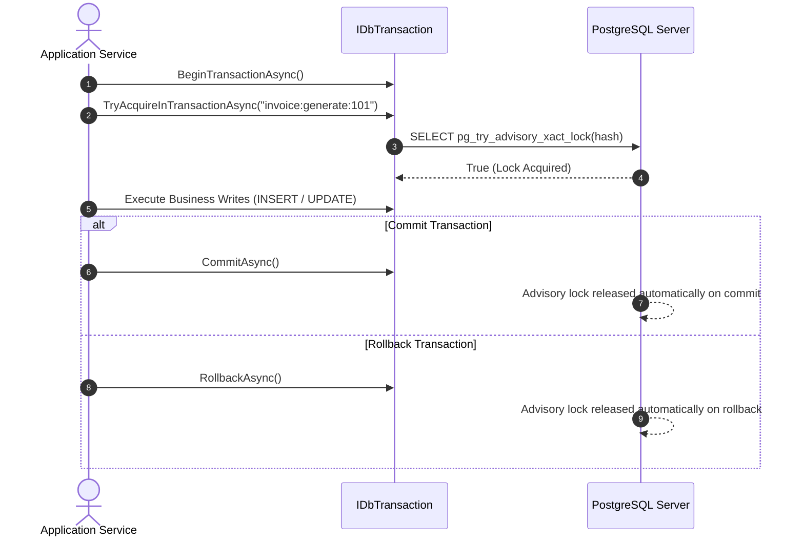
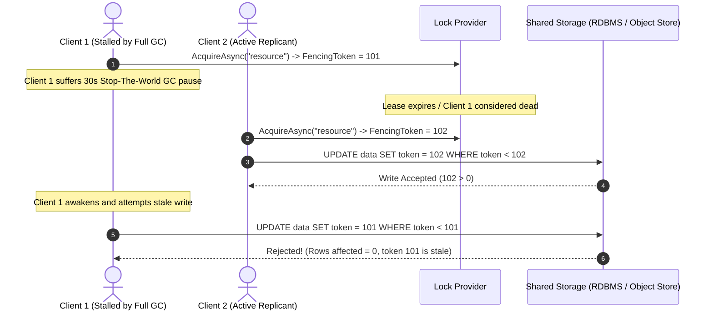

# Architecture Guide — EricksonLopez.DistributedLock

> **Architectural Specification, Component Topology, Distributed Invariants, and State Models**  
> **Version**: 1.0.0 | **Ecosystem**: `EricksonLopez.*` | **Target Runtimes**: .NET 8.0, .NET 9.0, .NET 10.0 | **Invariants**: 100% Native AOT, Zero-Allocation Result Pattern, Zero `[Obsolete]` Policy

---

## 1. System Overview

`EricksonLopez.DistributedLock` is a high-performance, Tier 0 distributed mutual exclusion and cluster coordination framework engineered for modern cloud-native .NET systems. It coordinates mission-critical background jobs, transactional workflows, event-driven message consumers, and batch processing across distributed replicas without requiring expensive external coordination clusters (such as Apache ZooKeeper or HashiCorp Consul).

### Core Architectural Principles

1. **Pure Tier 0 Abstraction**: Zero coupling between domain/application code and underlying storage engines. Core contracts (`IDistributedLockProvider`, `IDistributedLockHandle`, `DistributedLockErrors`) reside in `EricksonLopez.DistributedLock.Abstractions` with zero concrete database driver dependencies.
2. **Railway-Oriented Result Pattern**: Lock contention, timeouts, and cancellations return strongly typed `Result<IAsyncDisposable>` or `Result<IDistributedLockHandle>` structures powered by `EricksonLopez.Result`. Control flow never throws exceptions on expected contention, eliminating CPU thread starvation and stack unwinding overhead.
3. **Native Engine Storage Primitives**: Rather than imposing artificial coordination tables where native mechanisms exist, the suite leverages native database-level primitives:
   - **PostgreSQL**: Session and transaction advisory locks (`pg_try_advisory_lock`, `pg_advisory_xact_lock`).
   - **SQL Server**: Distributed application locks (`sp_getapplock`, `sp_releaseapplock`).
   - **MySQL & MariaDB**: User-level locks (`GET_LOCK`, `RELEASE_LOCK`) via `MySqlConnector`.
   - **Oracle**: Named application locks (`DBMS_LOCK.REQUEST`, `DBMS_LOCK.RELEASE`).
   - **SQLite**: Atomic coordination table (`__distributed_locks`) with millisecond TTL expiration.
   - **Redis**: Atomic mutex (`SET NX PX`), Lua script release, and periodic lease renewals.
4. **Active Keepalive & Socket Drop Detection**: Session locks run background heartbeat monitors (`PeriodicTimer`) that detect network partitions or socket severance, proactively signaling cooperative task aborts via `IDistributedLockHandle.HandleLostToken`.
5. **100% Native AOT & Trimming Compliant**: Zero runtime reflection, zero dynamic IL emission, and `sealed` concrete types to optimize devirtualization and binary trimming across .NET 8, 9, and 10.

---

## 2. Package Topology & Clean Architecture Layering

The system strictly enforces the Dependency Inversion Principle. Application and domain layers only reference the Tier 0 Abstractions, while concrete infrastructure dialect packages implement the provider contract.

---

## 3. Internal Dependency Graph

All provider packages depend strictly on `EricksonLopez.DistributedLock.Abstractions`. No circular references or cross-provider dependencies are permitted:

---

## 4. Dual Acquisition Modes & Jittered Polling Flow

The framework provides three acquisition paradigms:
1. **Immediate Non-Blocking Attempt (`TryAcquireAsync`)**: Executes a single non-blocking check against the engine.
2. **Bounded Polling with Jittered Exponential Backoff (`TryAcquireAsync(key, timeout)`)**: Repeatedly checks for lock availability while applying randomized exponential backoff to eliminate the "thundering herd" problem.
3. **Database-Level Blocking (`AcquireAsync(key)`)**: Delegates waiting directly to native database engine queues where available (`pg_advisory_lock`, `sp_getapplock`).

---

## 5. Lock Handle Lifecycle and State Machine

Lock handles implement `IDistributedLockHandle` and `IAsyncDisposable`. While held, handles maintain connection liveness, execute keepalive heartbeats, and immediately signal cancellation upon socket termination.

---

## 6. Transactional vs Session-Scoped Locks (PgBouncer Invariant)

PostgreSQL advisory locks illustrate the critical distinction between connection scopes:

- **Session-Level Locks (`pg_advisory_lock`)**: Bound to the physical PostgreSQL backend server process (`backend_pid`).
- **Transaction-Level Locks (`pg_advisory_xact_lock`)**: Bound to the active database transaction, automatically freed on `COMMIT` or `ROLLBACK`.

> [!WARNING]
> **PgBouncer / Connection Pooler Incompatibility**: When running behind PgBouncer with `pool_mode = transaction` or `pool_mode = statement`, session-level locks must **NEVER** be used on pooled connections, as subsequent queries are routed across differing physical server processes. In transactional pooler environments, either:
> 1. Use transaction-scoped locks (`TryAcquireInTransactionAsync`), or
> 2. Connect to a dedicated PgBouncer pool configured with `pool_mode = session`.

---

## 7. Fencing Tokens (Kleppmann Storage Invalidation Pattern)

In distributed systems, long Garbage Collection pauses (Stop-The-World) or network partitions can cause a process to lose its lock without realizing it before attempting to write to storage. To guard against stale writes, `IDistributedLockHandle` exposes a monotonic `FencingToken`.

---

## 8. Native Observability Architecture (OpenTelemetry)

`EricksonLopez.DistributedLock` produces native zero-allocation BCL metrics using `System.Diagnostics.Metrics.Meter` (`MeterName: EricksonLopez.DistributedLock`):

| Metric Name | Type | Description | Dimension Tags |
|---|:---:|---|---|
| `distributed_lock.acquisitions` | Counter | Total acquisition attempts | `resource_id`, `scope` (`session`/`transaction`), `status` (`acquired`, `already_held`, `timeout`, `canceled`, `error`) |
| `distributed_lock.wait_duration` | Histogram | Milliseconds spent waiting to acquire | `resource_id`, `scope`, `status` |
| `distributed_lock.hold_duration` | Histogram | Milliseconds the lock was held active | `resource_id`, `scope` |
| `distributed_lock.lost_events` | Counter | Instances of unexpected lock severance | `resource_id`, `reason` |

---

## 9. Native AOT & Trimming Invariants

The codebase enforces strict compiler and runtime invariants:
- `<IsAotCompatible>true</IsAotCompatible>` and `<EnableTrimAnalyzer>true</EnableTrimAnalyzer>` enabled in `Directory.Build.props`.
- Zero reflection or dynamic IL emission on critical execution paths.
- All concrete lock provider classes and internal handles are explicitly `sealed`.
- Dedicated Native AOT Smoke Test executable (`tests/EricksonLopez.DistributedLock.AotSmokeTest`) compiled and executed in CI under `/p:PublishAot=true /warnaserror`.
