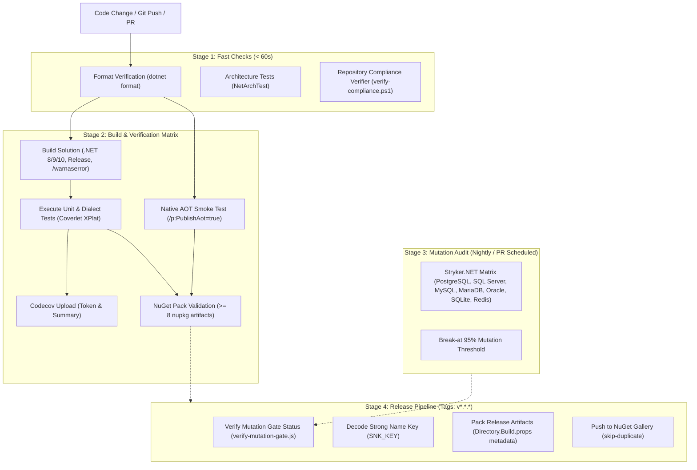

# Build, CI/CD, and Quality Engineering — EricksonLopez.DistributedLock

> **Formal Technical Specification of Continuous Integration, Automated Quality Gates, Mutation Testing, and Release Pipelines**  
> **Version**: 1.0.0 | **Ecosystem**: `EricksonLopez.*` | **Target Runtimes**: .NET 8.0, .NET 9.0, .NET 10.0

---

## 1. Overview & Pipeline Philosophy

The `EricksonLopez.DistributedLock` engineering pipeline operates under a zero-tolerance policy for compiler warnings, architectural regression, code coverage decline, and mutation survival. Every commit and pull request must satisfy rigorous static, architectural, dynamic, and native compilation quality gates before integration or release.

---

## 2. GitHub Actions Workflows

The repository defines three primary workflow definitions located in `.github/workflows/`:

### 1. `ci.yml` — Continuous Integration & Quality Gates
- **Trigger**:
  - `push` to branches `["main", "develop"]`
  - `pull_request` against branches `["main", "develop"]`
- **Concurrency**: Grouped by workflow and git ref (`cancel-in-progress: true`).
- **Jobs**:
  1. **`fast-checks`** (Runs on `ubuntu-latest`):
     - Sets up .NET SDKs `8.0.x`, `9.0.x`, and `10.0.x`.
     - `dotnet format --verify-no-changes`: Validates formatting and code style conventions.
     - `dotnet test tests/EricksonLopez.DistributedLock.ArchitectureTests/... --framework net10.0`: Validates zero obsolete APIs, one type per file, kebab-case naming, and package segregation.
     - `powershell ./scripts/verify-compliance.ps1`: Asserts license headers, package project URLs, and internal markdown link validity.
  2. **`build-and-test`** (Depends on `fast-checks`):
     - `dotnet restore EricksonLopez.DistributedLock.slnx`.
     - `dotnet build EricksonLopez.DistributedLock.slnx -c Release --no-restore /warnaserror`: Enforces zero warnings across all projects.
     - `dotnet test EricksonLopez.DistributedLock.slnx -c Release --no-build --collect:"XPlat Code Coverage" --filter "FullyQualifiedName!~IntegrationTests"`: Executes all unit test suites.
     - `codecov/codecov-action@v4`: Uploads coverage results to Codecov using secret `CODECOV_TOKEN`.
  3. **`aot-smoke-test`** (Depends on `fast-checks`):
     - `dotnet publish tests/EricksonLopez.DistributedLock.AotSmokeTest/... -c Release -r linux-x64 /p:PublishAot=true /warnaserror`.
     - Runs the compiled native binary on Ubuntu to ensure trim-safety and zero trimmable reflection warnings.
  4. **`pack-validation`** (Depends on `build-and-test`, `aot-smoke-test`):
     - `dotnet pack EricksonLopez.DistributedLock.slnx -c Release --no-build -o ./artifacts`.
     - Asserts that at least 8 `.nupkg` artifacts are successfully created.

### 2. `mutation-testing.yml` — Mutation Resilience (Stryker.NET)
- **Trigger**:
  - `pull_request` impacting `src/**` or `tests/**`.
  - `push` to `main`.
  - `schedule`: Nightly run at 02:00 UTC.
  - `workflow_dispatch` / `workflow_call`.
- **Jobs**:
  1. **`determine-scope`**: Computes execution mode (`is_full=true` on main/schedule; targeted on PRs). Configures dynamic matrix across all 7 dialect packages (`PostgreSql`, `SqlServer`, `MySql`, `MariaDb`, `Oracle`, `Sqlite`, `Redis`).
  2. **`stryker-audit`**: Runs `dotnet-stryker` using `--config-file stryker-config.json` with `--break-at 95 --concurrency 2`. Uploads mutation reports as workflow artifacts.

### 3. `publish.yml` — Automated NuGet Release
- **Trigger**:
  - `push` of tags matching `v*.*.*`.
  - `workflow_dispatch` with optional version input.
- **Jobs**:
  1. **`mutation-gate-check`**: Executes `scripts/verify-mutation-gate.js` via `actions/github-script@v7` to ensure all target packages meet the $\ge 95\%$ mutation score threshold on the committing commit.
  2. **`stryker-gate`**: Conditionally triggers `mutation-testing.yml` if mutations were not evaluated yet.
  3. **`publish`**:
     - Decodes `secrets.SNK_KEY` to restore `EricksonLopez.snk` for assembly signing.
     - Builds and packs Release packages.
     - Pushes all `.nupkg` packages to NuGet Gallery using `secrets.NUGET_API_KEY` and `--skip-duplicate`.

---

## 3. Required Pipeline Secrets

| Secret Name | Consuming Workflow | Purpose |
|---|:---:|---|
| `CODECOV_TOKEN` | `ci.yml` | Authentication token for Codecov test coverage reports. |
| `SNK_KEY` | `publish.yml` | Base64-encoded Strong Name Key used to sign released assemblies. |
| `NUGET_API_KEY` | `publish.yml` | API Key for publishing packages to `api.nuget.org`. |
| `GITHUB_TOKEN` | All | Default GitHub Actions token for status checks and PR comments. |

---

## 4. Quality Gate Standards

### Code Coverage Policy
- Unit test execution collects OpenCover/Cobertura coverage reports using `coverlet.collector` (v6.0.4).
- Minimum acceptable line coverage is **95.0%** across core abstraction logic.

### Mutation Testing Policy (Stryker.NET)
- Thresholds configured across all 8 projects in `src/`:
  - **High**: `100%`
  - **Low**: `98%`
  - **Break**: `95%`
- Concurrency pinned to `2` to maintain deterministic test execution against local storage.
- Anti-gaming blacklist strictly enforced by `scripts/verify-compliance.ps1` (prohibits ignoring guard clauses or error handling methods).

### Static Analysis & Compiler Invariants
- `TreatWarningsAsErrors=true`: Zero compiler warnings tolerated in Release builds.
- `AnalysisLevel=latest-recommended`: Modern Roslyn analyzers active for .NET 8, 9, and 10.
- `ImplicitUsings=disable`: Enforces solution-wide explicit namespace imports.
- `IsAotCompatible=true` & `EnableTrimAnalyzer=true`: Immediate build failure if trimmable reflection is introduced.
